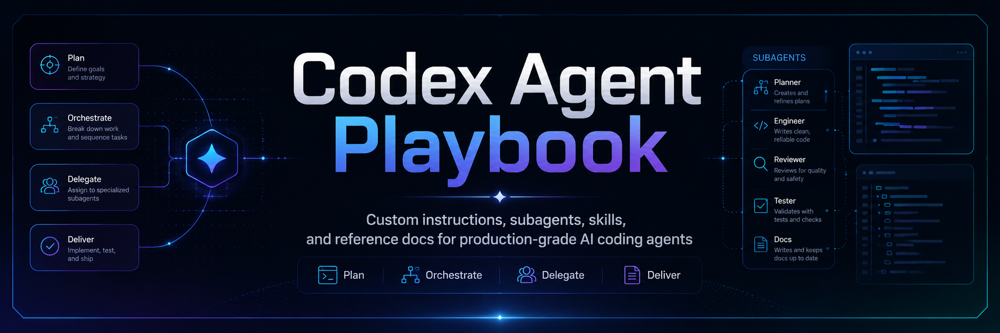

<p align="center">
  
</p>

<h1 align="center">Codex Agent Playbook</h1>

<p align="center">
  <strong>Custom instructions, subagents, skills, and reference docs for production-grade AI coding agents.</strong>
</p>

<p align="center">
  Configure Codex to behave less like a loose autocomplete engine and more like a disciplined senior engineer: plan clearly, change surgically, delegate carefully, verify honestly, and ship maintainable code.
</p>

<p align="center">
  <a href="#install-with-one-prompt">Install</a> ·
  <a href="#quick-start">Quick Start</a> ·
  <a href="#why-this-exists">Why This Exists</a> ·
  <a href="#whats-inside">What's Inside</a> ·
  <a href="#subagent-model">Subagent Model</a> ·
  <a href="#repository-structure">Structure</a>
</p>

<p align="center">
  
  
  
  
</p>

---

## Install with One Prompt

The easiest install path is to give this repo URL to your coding agent:

```text
Install this globally: https://github.com/ArcanEdge-AI/codex-agent-playbook

Follow the repository's INSTALL.md exactly. Preserve my existing instructions, back up anything you change, install the global instructions, references, skills, and custom subagents where supported, then report the installed files and validation results.
```

That is the intended public experience: users should not need to understand the file layout before installation. The agent should read `INSTALL.md`, clone or fetch the repo, install into user-level Codex/agent configuration locations, validate the result, and report what changed.

For users who already pasted the global instructions into Codex Personalization, use support-only mode:

```text
Install this in support-only mode: https://github.com/ArcanEdge-AI/codex-agent-playbook

I already added the global custom instructions manually. Follow INSTALL.md, but do not duplicate the full instructions into AGENTS.md. Install references, skills, and custom subagents only.
```

---

## Quick Start

### Agent install

Ask your coding agent to install the repo URL and follow `INSTALL.md`.

### Manual install: macOS / Linux / WSL

```bash
git clone https://github.com/ArcanEdge-AI/codex-agent-playbook.git
cd codex-agent-playbook
bash install/install.sh --full
```

Support-only mode:

```bash
bash install/install.sh --support-only
```

Dry run:

```bash
bash install/install.sh --full --dry-run
```

### Manual install: Windows PowerShell

```powershell
git clone https://github.com/ArcanEdge-AI/codex-agent-playbook.git
cd codex-agent-playbook
pwsh -ExecutionPolicy Bypass -File install/install.ps1 -Full
```

Support-only mode:

```powershell
pwsh -ExecutionPolicy Bypass -File install/install.ps1 -SupportOnly
```

Dry run:

```powershell
pwsh -ExecutionPolicy Bypass -File install/install.ps1 -Full -DryRun
```

### Repo-specific guidance

Copy this template into individual projects as a starting point:

```text
references/templates/repository-AGENTS.md
```

Then fill in the actual build commands, test commands, architecture rules, generated-file rules, and release expectations for that repository.

---

## Why This Exists

AI coding agents are powerful, but they often fail in predictable ways:

- They start coding before understanding the codebase.
- They over-engineer simple requests.
- They refactor unrelated code.
- They trust editor diagnostics over real builds.
- They claim tests passed when they did not run them.
- They delegate poorly or blindly accept subagent output.
- They turn every task into a context dump instead of a focused engineering loop.

This playbook gives Codex a durable operating model:

```text
Understand → Plan → Implement → Verify → Review → Report
```

The intent is not to make the agent slower for its own sake. The intent is to make it **less wrong**, especially on real repositories with existing conventions and local changes.

---

## What's Inside

| Area | Path | Purpose |
| --- | --- | --- |
| Install guide | `INSTALL.md` | Agent-readable install contract for one-prompt installation. |
| Install scripts | `install/` | Manual installers for Unix-like shells and PowerShell. |
| Global instructions | `custom-instructions/` | Tool-agnostic behavior rules for elegant, maintainable code. |
| Setup prompt | `codex-prompts/` | Prompt for creating user-level references, skills, and subagents. |
| Reference docs | `references/` | Routing, subagent delegation, and reusable project-doc templates. |
| Skills | `skills/` | Reusable workflows for orchestration, doc routing, and senior review. |
| Custom agents | `agents/` | Example subagent definitions for exploration, review, research, triage, and isolated implementation. |
| Repo guidance | `AGENTS.md` | Instructions for maintaining this public playbook repository. |

---

## Install Modes

### Full install

Use this for most users.

Full install writes the global instructions into the user's Codex home `AGENTS.md`, then installs references, skills, and custom subagents.

### Support-only install

Use this when the user already added the global instructions through Codex Personalization → Custom instructions.

Support-only mode avoids duplicating the full instruction file and installs only the supporting reference docs, skills, and custom subagents.

---

## Core Philosophy

The main agent is the senior engineer and orchestrator.

It owns:

- task understanding
- the working plan
- architecture and design judgment
- delegation decisions
- final implementation
- final diff
- validation strategy
- final response

Subagents can help, but they do not own the outcome. Their job is to return bounded findings with evidence. The main agent must verify before accepting.

> Use subagents when they create leverage. Do not use them just because they are available.

---

## Subagent Model

This playbook treats subagents like focused engineering assistants, not autonomous owners.

| Subagent | Default mode | Best for |
| --- | --- | --- |
| `read_only_explorer` | Read-only | Mapping code paths, call sites, ownership boundaries, and insertion points. |
| `senior_reviewer` | Read-only | Reviewing diffs for correctness, regressions, scope creep, maintainability, safety, performance, and accessibility. |
| `docs_researcher` | Read-only | Checking framework, library, API, or platform behavior against authoritative docs. |
| `test_triager` | Read-mostly | Analyzing failing tests, logs, flakes, snapshots, and likely root causes. |
| `isolated_worker` | Bounded write | Implementing small isolated changes after scope and design are clear. |

The delegation rule is simple:

```text
Precise assignment → Evidence-backed output → Main-agent verification → Accept or reject
```

A good subagent prompt includes role, goal, context, scope, non-goals, permissions, required evidence, output format, and stop conditions.

---

## Reference Docs Without Context Soup

Large documents are useful only when routed correctly.

The main agent should:

1. Identify which docs matter for the task.
2. Read only relevant sections when possible.
3. Classify docs as authoritative, advisory, or historical.
4. Pass only relevant context to subagents.
5. Resolve conflicts using primary evidence.

Primary evidence includes current code, tests, schemas, configuration, logs, build output, typecheck output, runtime behavior, and authoritative external documentation.

See:

```text
references/reference-doc-routing.md
references/subagents.md
```

---

## Repository Structure

```text
.
├── AGENTS.md
├── CONTRIBUTING.md
├── INSTALL.md
├── README.md
├── assets/
│   └── codex-agent-playbook-hero.png
├── agents/
│   ├── docs-researcher.toml
│   ├── isolated-worker.toml
│   ├── read-only-explorer.toml
│   ├── senior-reviewer.toml
│   └── test-triager.toml
├── codex-prompts/
│   └── setup-global-codex-support-system.md
├── custom-instructions/
│   └── global-coding-agent-instructions.md
├── install/
│   ├── install.ps1
│   └── install.sh
├── references/
│   ├── README.md
│   ├── reference-doc-routing.md
│   ├── subagents.md
│   └── templates/
│       ├── api-contracts.md
│       ├── architecture.md
│       ├── data-model.md
│       ├── design-system.md
│       ├── release.md
│       ├── repository-AGENTS.md
│       ├── security.md
│       └── testing.md
└── skills/
    ├── reference-doc-routing/
    │   └── SKILL.md
    ├── senior-code-review/
    │   └── SKILL.md
    └── subagent-orchestration/
        └── SKILL.md
```

---

## Example: Better Delegation

Bad delegation:

```text
Look into this and fix it.
```

Better delegation:

```text
Role:
You are a read-only explorer.

Goal:
Find where checkout tax is calculated and identify the smallest safe insertion point for a customer exemption flag.

Scope:
Inspect checkout, cart, customer, and tax calculation code paths only.

Non-goals:
Do not edit files. Do not refactor. Do not propose a new tax engine.

Evidence required:
Return file paths, function names, call chain, relevant tests, and existing exemption concepts.
```

The main agent still decides the design, applies or rejects recommendations, and verifies the final diff.

---

## Recommended Workflow

```text
1. Ask your coding agent to install this repository URL.
2. Let the installer configure global instructions, references, skills, and subagents.
3. Add repo-specific AGENTS.md guidance to each project.
4. For non-trivial work, let the main agent plan first.
5. Delegate only bounded work with clear evidence requirements.
6. Verify the final diff before accepting completion.
```

---

## Public Repo Notes

This repository is public so others can star it, fork it, adapt it, and propose improvements.

Please keep contributions generic, reusable, and safe for public use. Do not add private project details, internal URLs, sensitive access material, local machine quirks, or one-off incident logs.

See `CONTRIBUTING.md` for contribution guidance.

---

## License

No license has been selected yet.

If you want others to freely use and fork this playbook, choose an explicit license. MIT is a common default for permissive open-source documentation and examples, but the repository owner should make that decision intentionally.

---

## Status

This is a living playbook. Treat it as a strong baseline, not a universal law.

The best setup is:

```text
Global behavior + local repository truth + evidence-backed validation
```
