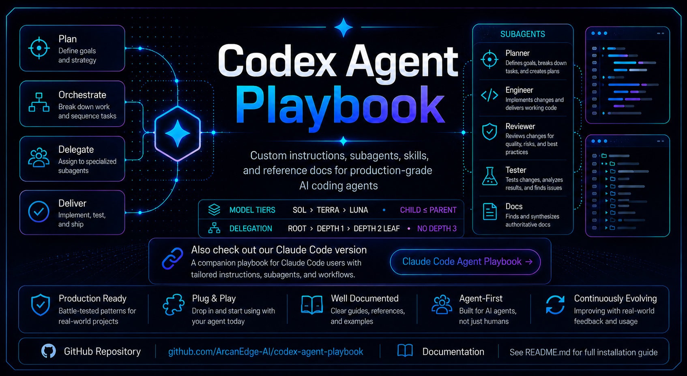

<p align="center">
  
</p>

<h1 align="center">Codex Agent Playbook</h1>

<p align="center">
  <strong>Custom instructions, subagents, skills, and reference docs for production-grade AI coding agents.</strong>
</p>

<p align="center">
  Configure Codex to behave less like a loose autocomplete engine and more like a disciplined senior engineer: orchestrate subagent execution, plan clearly, coordinate parallel work, verify honestly, and ship maintainable code.
</p>

<p align="center">
  <a href="#install-with-one-prompt">Install</a> ·
  <a href="#quick-start">Quick Start</a> ·
  <a href="#related-playbooks">Related Playbooks</a> ·
  <a href="#why-this-exists">Why This Exists</a> ·
  <a href="#whats-inside">What's Inside</a> ·
  <a href="#subagent-model">Subagent Model</a> ·
  <a href="#task-local-worktree-lifecycle">Worktrees</a> ·
  <a href="#coordinating-parallel-codex-threads">Parallel Threads</a> ·
  <a href="#repository-structure">Structure</a>
</p>

<p align="center">
  
  
  
  
  <a href="https://github.com/ArcanEdge-AI/claude-code-agent-playbook"></a>
  
  
</p>

<p align="center">
  <strong>Using Claude Code instead?</strong>
  <a href="https://github.com/ArcanEdge-AI/claude-code-agent-playbook">Open the Claude Code Agent Playbook</a>.
</p>

---

## Install with One Prompt

The easiest install path is to give this repo URL to your coding agent:

```text
Install this globally: https://github.com/ArcanEdge-AI/codex-agent-playbook

Follow the repository's INSTALL.md exactly. Preserve my existing instructions, back up anything you change, install the global instructions, references, skills, and custom subagents where supported, then report the installed files and validation results.
```

That is the intended public experience: users should not need to understand the file layout before installation. The agent should read `INSTALL.md`, clone or fetch the repo, install into user-level Codex/agent configuration locations, validate the result, and report what changed.

For users who already pasted the global instructions into Codex Personalization, use support-only mode:

```text
Install this in support-only mode: https://github.com/ArcanEdge-AI/codex-agent-playbook

I already added the global custom instructions manually. Follow INSTALL.md, but do not duplicate the full instructions into AGENTS.md. Install references, skills, and custom subagents only.
```

---

## Quick Start

### Agent install

Ask your coding agent to install the repo URL and follow `INSTALL.md`.

### Manual install: macOS / Linux / WSL

```bash
git clone https://github.com/ArcanEdge-AI/codex-agent-playbook.git
cd codex-agent-playbook
bash install/install.sh --full
```

Support-only mode:

```bash
bash install/install.sh --support-only
```

Dry run:

```bash
bash install/install.sh --full --dry-run
```

### Manual install: Windows PowerShell

```powershell
git clone https://github.com/ArcanEdge-AI/codex-agent-playbook.git
cd codex-agent-playbook
pwsh -ExecutionPolicy Bypass -File install/install.ps1 -Full
```

Support-only mode:

```powershell
pwsh -ExecutionPolicy Bypass -File install/install.ps1 -SupportOnly
```

Dry run:

```powershell
pwsh -ExecutionPolicy Bypass -File install/install.ps1 -Full -DryRun
```

### Repo-specific guidance

Copy this template into individual projects as a starting point:

```text
references/templates/repository-AGENTS.md
```

Then fill in the actual build commands, test commands, architecture rules, generated-file rules, and release expectations for that repository.

---

## Related Playbooks

This repository is the Codex-focused version of the playbook.

| Agent environment | Repository | Use when |
| --- | --- | --- |
| Codex | `ArcanEdge-AI/codex-agent-playbook` | You want global Codex custom instructions, reference docs, skills, and subagent definitions. |
| Claude Code | [`ArcanEdge-AI/claude-code-agent-playbook`](https://github.com/ArcanEdge-AI/claude-code-agent-playbook) | You want the companion setup tuned for Claude Code. |

The philosophy is shared across both: the main agent acts as the senior engineer/orchestrator, subagents perform bounded evidence-backed execution, independent project threads are coordinated explicitly, and final decisions stay with the main agent.

---

## Why This Exists

AI coding agents are powerful, but they often fail in predictable ways:

- They start coding before understanding the codebase.
- They over-engineer simple requests.
- They refactor unrelated code.
- They trust editor diagnostics over real builds.
- They claim tests passed when they did not run them.
- They delegate poorly or blindly accept subagent output.
- They allow parallel features to develop incompatible contracts or ownership.
- They turn every task into a context dump instead of a focused engineering loop.

This playbook gives Codex a durable operating model:

```text
Understand → Plan → Implement → Verify → Review → Report
```

The intent is not to make the agent slower for its own sake. The intent is to make it **less wrong**, especially on real repositories with existing conventions, local changes, and concurrent work.

---

## What's Inside

| Area | Path | Purpose |
| --- | --- | --- |
| Install guide | `INSTALL.md` | Agent-readable install contract for one-prompt installation. |
| Install scripts | `install/` | Manual installers for Unix-like shells and PowerShell. |
| Global instructions | `custom-instructions/` | Tool-agnostic behavior rules for elegant, maintainable code. |
| Prompts | `codex-prompts/` | Setup and active-project coordination prompts. |
| Reference docs | `references/` | Model routing, subagent delegation, multi-session coordination, document routing, and reusable project-doc templates. |
| Skills | `skills/` | Reusable workflows for task-graph and subagent orchestration, multi-session coordination, doc routing, and senior review. |
| Custom agents | `agents/` | Codex subagent definitions for planning, engineering, review, testing, and documentation. |
| Repo guidance | `AGENTS.md` | Instructions for maintaining this public playbook repository. |

---

## Install Modes

### Full install

Use this for most users.

Full install writes the global instructions into the user's Codex home `AGENTS.md`, then installs references, skills, and custom subagents.

### Support-only install

Use this when the user already added the global instructions through Codex Personalization → Custom instructions.

Support-only mode avoids duplicating the full instruction file and installs only the supporting reference docs, skills, and custom subagents.

---

## Core Philosophy

The main agent is the senior engineer and orchestrator.

It owns:

- task understanding
- the working plan
- architecture and design judgment
- routing, decomposition, and delegation decisions
- parallel-work coordination
- integration and final acceptance
- final diff
- validation strategy
- final response

For every repository task, subagents perform the bounded execution work when they are available. The main agent remains accountable for the outcome. Independent project threads may own separate workstreams, but the main coordinating agent still owns compatibility and integration decisions.

> At the root, delegate actual execution to at least one bounded subagent for every repository task when subagents are available. Root direct main-agent execution is limited to unavailable subagents, an explicit user prohibition, or an authority-bound action that cannot be delegated; record the exact exception.

For work with multiple delegable parts, the main agent maps bounded work nodes, real blocking dependencies, write ownership or read scope, and verification gates before fan-out. Dispatch a child only when it is already a finite-manifest member, fits the remaining total node budget, holds its required root permit, and fits runtime, safety, and ownership capacity. Expand the manifest or budget only for a newly discovered dependency, invalidated gate, or changed user scope; a material expansion also needs immediate user approval. Real dependencies, verified isolation, and user instructions also constrain concurrency; serialize only real conflicts. Small or linear tasks may skip formal graph mode but still require bounded subagent execution.

Subagents share the current workspace by default. Worktrees have a separate finite budget that starts at zero; they are created only by the root for a verified isolation need, not per agent. The root may authorize one active auxiliary without additional approval; two or more require user approval for the exact count and reasons. Every task-created auxiliary worktree is integrated and safely removed inside the task or preserved with an exact blocker. No scheduled cleanup task is required for this lifecycle.

---

## Subagent Model

This playbook uses five Codex subagent roles that mirror a practical software delivery loop.

| Subagent | Default mode | Best for |
| --- | --- | --- |
| `planner` | Read-only | Decomposing non-trivial tasks, identifying risks, sequencing work, and defining validation. |
| `engineer` | Bounded write | Implementing small, well-scoped changes after the plan and constraints are clear. |
| `reviewer` | Read-only | Reviewing diffs, designs, and implementations for correctness, risk, maintainability, and scope discipline. |
| `tester` | Read-mostly | Reproducing failures, analyzing test output, finding validation gaps, and recommending targeted checks. |
| `docs` | Read-only | Finding, interpreting, and summarizing relevant repo docs, reference docs, and authoritative external documentation. |

The bundled profiles explicitly pin a task-sized supporting model and role-appropriate reasoning effort instead of inheriting the main session model. Consult `references/model-routing.md` for mandatory selection, escalation, and acceptance rules.

The delegation rule is simple:

```text
Precise assignment → Evidence-backed output → Main-agent verification → Accept or reject
```

A good subagent prompt includes role, goal, context, selected profile or model, reasoning effort, scope, non-goals, permissions, required evidence, escalation conditions, output format, and stop conditions.

For multi-node work, it also identifies the node, its inputs and accepted output, blocking dependencies, ownership or read scope, and verification gate. The orchestration skill explains fan-out, handoff validation, selective retries, and final combined validation.

### Recursive delegation and token economy

The root owns a finite manifest, total spawned-node budget, and child-specific permits. Every dispatched child must already be a finite-manifest member, fit the remaining total node budget, hold its required root permit, and fit runtime, safety, and ownership capacity. Expand the manifest or budget only for a newly discovered dependency, invalidated gate, or changed user scope; a material expansion also needs immediate user approval. Profiles are callable only when the host supports custom-agent invocation, including an `@tag` interface if offered, and are depth 1. A root-permitted depth-1 local orchestrator may create declared depth-2 leaves. Depth 2 executes directly and cannot spawn. For each child, model and reasoning effort must be at or below the explicit ceiling of its parent; descendants cannot upgrade and must stop and report if insufficient. When capacity is full, do not queue speculative descendants. This is instruction-only, not a scheduler.

---

## Formal Task-Graph Orchestration

Use `task-graph-orchestration` for complex work with substantial fan-out, genuine dependencies, broad scope, layered consolidation, or separate implementation and verification paths. Prompt engineering defines each node; task-graph orchestration defines how the nodes connect, become ready, merge, fail, and require approval. Small or linear work may skip the formal graph, but not default subagent execution.

The graph is an instruction and Markdown artifact. It does not add a graph database, scheduler, runner, dependency, or orchestration framework. Medium tasks can keep the graph in the working plan. Long-running, multi-phase, or multi-session implementation may use `.codex/task-graphs/<task-slug>.md` when repository policy permits it.

Supporting files:

```text
skills/task-graph-orchestration/SKILL.md
references/templates/task-graph.md
```

Run multi-session coordination first when active threads, branches, worktrees, or pull requests may create external ownership or hidden dependency edges. Keep simple or genuinely linear tasks on the normal engineering loop.

---

## Task-Local Worktree Lifecycle

The worktree policy prevents swarm fan-out from becoming checkout fan-out:

```text
Current workspace + auxiliary budget 0
    ↓
Concrete isolation need verified
    ↓
Root issues one finite worktree permit
    ↓
Assigned nodes reuse that exact workspace
    ↓
Root integrates and validates the result
    ↓
Remove safely, or preserve with an exact blocker
```

Only the root may create, adopt, repurpose, move, or remove an auxiliary worktree. It may authorize one active auxiliary without additional approval; two or more require approval for the exact count and reasons. Descendants receive an exact workspace assignment and report any additional isolation need upward. Retries reuse compatible worktrees. Overlapping writers normally serialize because separate checkouts do not remove design or merge conflicts.

Before the final response, the root reconciles every task-created auxiliary worktree. It either verifies safe non-force removal inside the task or reports the exact path, owner, branch or HEAD, blocker, and next action. The workflow does not defer task-owned cleanup to scheduled automation and does not treat host-managed or pre-existing user worktrees as disposable.

Supporting files:

```text
references/worktrees.md
references/templates/worktree-manifest.md
skills/worktree-lifecycle/SKILL.md
```

---

## Coordinating Parallel Codex Threads

Subagents are delegated from one main thread. Independent Codex threads may already have separate plans, branches, worktrees, assumptions, and implementation ownership.

Use the multi-session coordination workflow when related project work is happening in parallel:

```text
Current project
    ↓
Threads active within the previous 72 hours
    ↓
Branches, worktrees, pull requests, and unmerged changes
    ↓
Shared change map and conflict detection
    ↓
Ownership, sequencing, and integration verification
```

Repository state takes precedence over recency. Older work still matters when it remains unmerged, incomplete, blocked, contract-relevant, or otherwise active.

New project threads should use this naming format:

```text
Project - Three-to-Four-Word Description
```

Examples:

```text
ArcLedger - Validate Billing Evidence
LoreBound - Implement Campaign Imports
```

The project name should be detected automatically, and the description should be derived from the primary objective. The square brackets used when explaining the format are not part of the actual title.

Start the workflow with:

```text
codex-prompts/coordinate-active-project-work.md
```

Supporting files:

```text
references/multi-session-coordination.md
references/templates/active-work-record.md
skills/multi-session-coordination/SKILL.md
```

The optional active-work record gives repositories a local fallback when direct sibling-thread discovery is unavailable. It is advisory and must be verified against current repository evidence.

---

## Reference Docs Without Context Soup

Large documents are useful only when routed correctly.

The main agent should:

1. Identify which docs matter for the task.
2. Read only relevant sections when possible.
3. Classify docs as authoritative, advisory, or historical.
4. Pass only relevant context to subagents or active project threads.
5. Resolve conflicts using primary evidence.

Primary evidence includes current code, tests, schemas, configuration, logs, build output, typecheck output, runtime behavior, and authoritative external documentation.

See:

```text
references/model-routing.md
references/reference-doc-routing.md
references/subagents.md
references/multi-session-coordination.md
references/worktrees.md
```

---

## Repository Structure

```text
.
├── .gitattributes
├── AGENTS.md
├── CONTRIBUTING.md
├── INSTALL.md
├── LICENSE
├── README.md
├── assets/
│   └── codex-agent-playbook-hero.png
├── agents/
│   ├── docs.toml
│   ├── engineer.toml
│   ├── planner.toml
│   ├── reviewer.toml
│   └── tester.toml
├── codex-prompts/
│   ├── coordinate-active-project-work.md
│   └── setup-global-codex-support-system.md
├── custom-instructions/
│   └── global-coding-agent-instructions.md
├── install/
│   ├── install.ps1
│   └── install.sh
├── references/
│   ├── README.md
│   ├── model-routing.md
│   ├── multi-session-coordination.md
│   ├── reference-doc-routing.md
│   ├── subagents.md
│   ├── worktrees.md
│   └── templates/
│       ├── active-work-record.md
│       ├── api-contracts.md
│       ├── architecture.md
│       ├── data-model.md
│       ├── design-system.md
│       ├── release.md
│       ├── repository-AGENTS.md
│       ├── security.md
│       ├── task-graph.md
│       ├── worktree-manifest.md
│       └── testing.md
└── skills/
    ├── multi-session-coordination/
    │   └── SKILL.md
    ├── reference-doc-routing/
    │   └── SKILL.md
    ├── senior-code-review/
    │   └── SKILL.md
    ├── subagent-orchestration/
    │   └── SKILL.md
    ├── task-graph-orchestration/
    │   └── SKILL.md
    └── worktree-lifecycle/
        ├── agents/
        │   └── openai.yaml
        └── SKILL.md
```

---

## Example: Better Delegation

Bad delegation:

```text
Look into this and fix it.
```

Better delegation:

```text
Role:
You are the Planner subagent for this task.

Goal:
Identify the smallest safe implementation plan for adding a customer exemption flag to checkout tax calculation.

Scope:
Inspect checkout, cart, customer, and tax calculation code paths only.

Non-goals:
Do not edit files. Do not refactor. Do not propose a new tax engine.

Evidence required:
Return file paths, function names, likely insertion points, relevant tests, and existing exemption concepts.
```

The main agent still decides the design, applies or rejects recommendations, and verifies the final diff.

---

## Recommended Workflow

```text
1. Ask your coding agent to install this repository URL.
2. Let the installer configure global instructions, references, skills, and subagents.
3. Add repo-specific AGENTS.md guidance to each project.
4. Let the main agent frame, route, and coordinate each repository task.
5. At the root, record the finite manifest, total node budget, and child-specific permits; select host-callable depth-1 profiles, including an `@tag` interface only if offered, with model and reasoning effort at or below the parent explicit ceiling. A permitted depth-1 node may create declared depth-2 leaves, which cannot spawn.
6. For multi-node work, identify real blocking dependencies, parallel-safe nodes, ownership, and verification gates, then dispatch only finite-manifest members that fit the remaining total node budget, hold required root permits, and fit runtime, safety, and ownership capacity. Expand the manifest or budget only for a newly discovered dependency, invalidated gate, or changed user scope; get immediate user approval for a material expansion.
7. Keep the auxiliary-worktree budget at zero unless root verifies a real isolation need. Before completion, remove each task-created auxiliary worktree safely or preserve it with an exact blocker.
8. When independent project threads run in parallel, use the multi-session coordination skill.
9. Verify the final combined diff and integrated behavior before accepting completion.
```

---

## Public Repo Notes

This repository is public so others can star it, fork it, adapt it, and propose improvements.

Please keep contributions generic, reusable, and safe for public use. Do not add private project details, internal URLs, sensitive access material, local machine quirks, or one-off incident logs.

See `CONTRIBUTING.md` for contribution guidance.

---

## License

MIT © 2026 ArcanEdge AI. See [`LICENSE`](./LICENSE).

---

## Status

This is a living playbook. Treat it as a strong baseline, not a universal law.

The best setup is:

```text
Global behavior + local repository truth + evidence-backed validation
```
